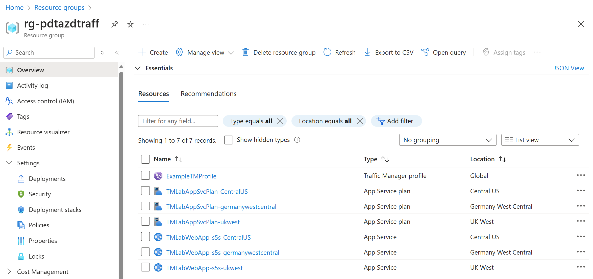
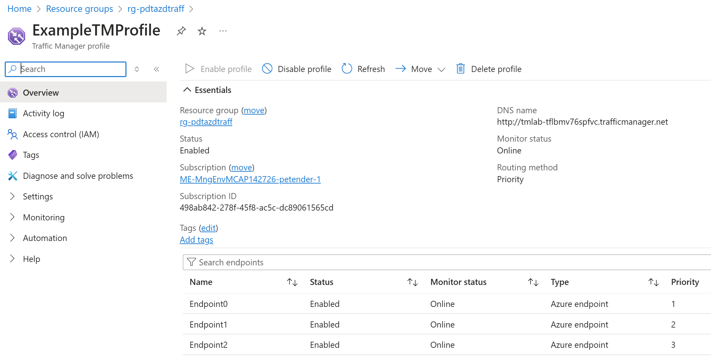
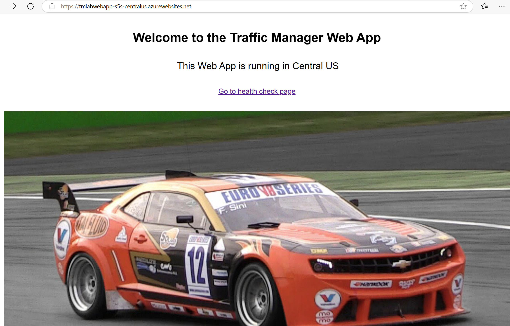
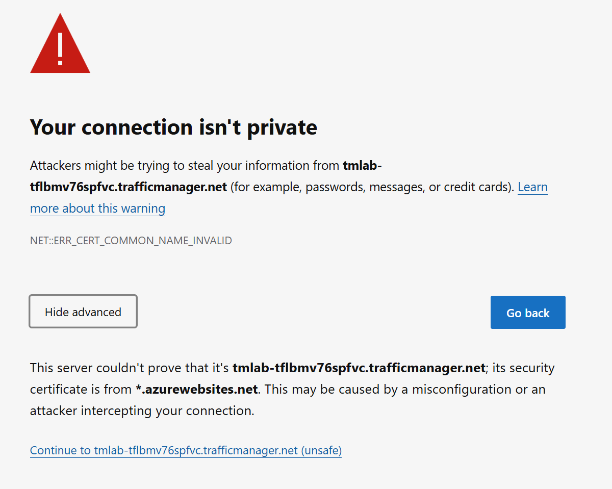
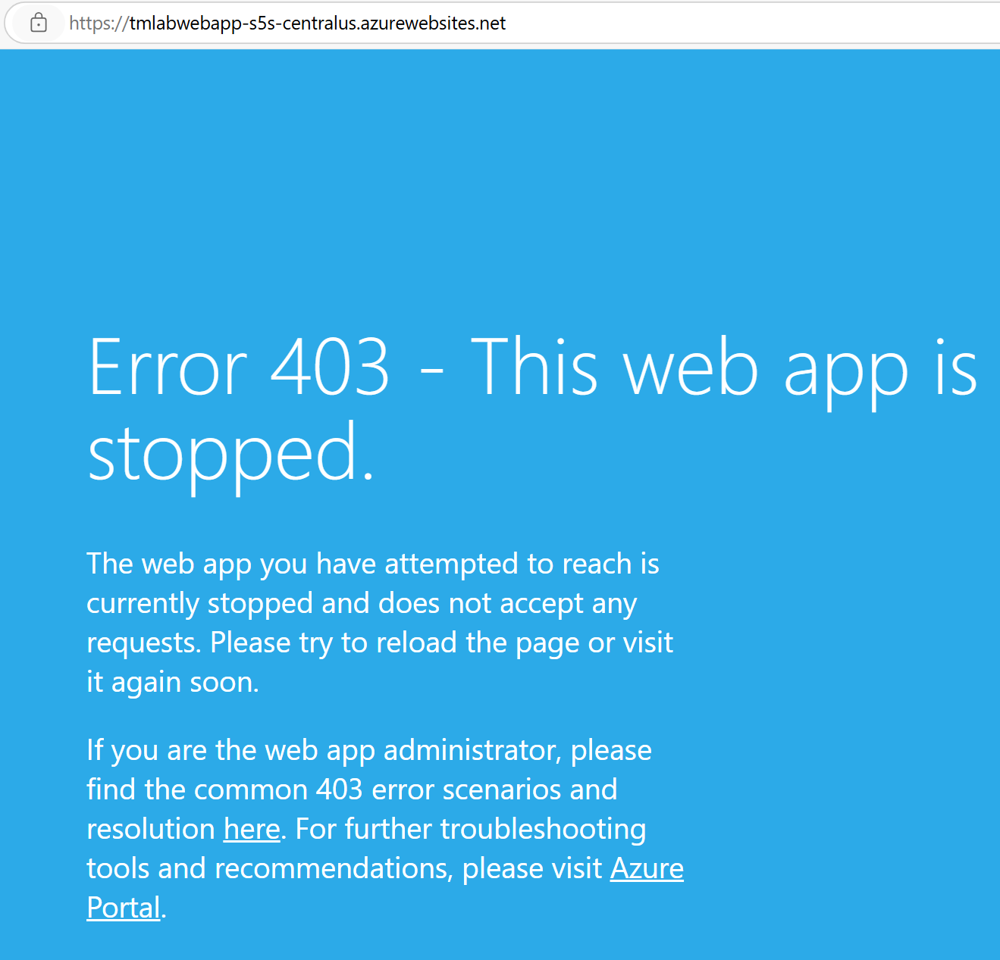
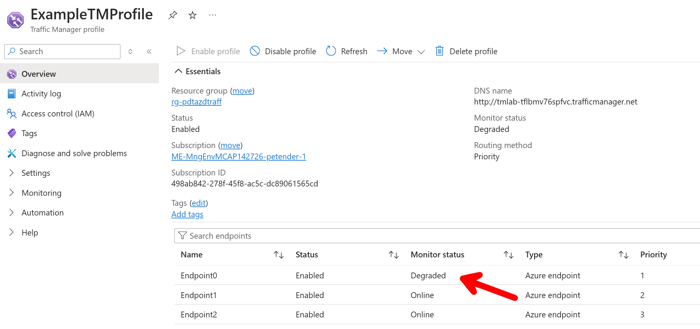

[comment]: <> (please keep all comment items at the top of the markdown file)
[comment]: <> (please do not change the ***, as well as 
 placeholders for Note and Tip layout)
[comment]: <> (please keep the ### 1. and 2. titles as is for consistency across all demoguides)
[comment]: <> (section 1 provides a bullet list of resources + clarifying screenshots of the key resources details)
[comment]: <> (section 2 provides summarized step-by-step instructions on what to demo)

[comment]: <> (this is the section for the Note: item; please do not make any changes here)
***
### Traffic Manager Profile with 3 webapps in 3 regions - demo scenario

**Note:** Below demo steps should be used **as a guideline** for doing your own demos. Please consider contributing to add additional demo steps.

[comment]: <> (this is the section for the Tip: item; consider adding a Tip, or remove the section between 
 and 
 if there is no tip)

***
### 1. What Resources are getting deployed
This scenario deploys 3 identical Azure App Services websites, across 3 different regions (Central US, Germany West Central, UK West), together with an Azure Traffic Manager Profile. Each webapp is a load-balanced endpoint behind Traffic Manager, using **Priority** as load balancing mechanism.

* rg-%azdenvironmentname - Azure Resource Group.
* TMLABAppSvcPlan-%region% - Azure App Service Plan in each region
* TMLABWebApp-%region% - Azure App Service with static HTML webpage in each region
* TMProfile - Traffic Manager Profile with endpoints

  

  

  

### 2. What can I demo from this scenario after deployment

1. Navigate to the Resource Group, and explain the different Azure resources deployed in each region. 
1. Open one of the WebApp Resources in a region; navigate to the URL and open the actual website.
1. Do the same for a WebApp in a different region, highlighting they are 3 identical websites.
1. Navigate to the **Traffic Manager Profile**, highlighting the 3 different endpoints. Open one of the endpoints and emphasize the region it points to
1. Browse to the Traffic Manager URL using its DNS Name property (https://tmlabxyz.trafficmanager.net). As there is no TLS certificate configured for the website, nor the Traffic Mgr load balancer, it will throw an error.

  

1. From the Browser error appearing, click **Continue to... (not recommended)**
1. Highlight the website is showing through the load balancing Traffic Manager URL. It should say the region is "Central US". 

1. Navigate back to the Azure App Service resource in Central US.
1. Stop the App Service
1. Once stopped, navigate to the tmlabwebapp-centralUS web page; refresh the page and confirm it shows stopped.

  

1. Switch back to the Traffic Manager Profile, and confirm (or refresh until...) the **Endpoint 0** shows a state of **Degraded**

  

1. From the Browser, navigate back to the tmlabxyz.trafficmanager.net URL. Note you will get the same https certificate error. Click continue to open the web page.

1. The page should now load from a **different region - Germany West Central** which is specified as the next priority in the TM Profile.

[comment]: <> (this is the closing section of the demo steps. Please do not change anything here to keep the layout consistant with the other demoguides.)
  
***

**Note:** This is the end of the current demo guide instructions.

